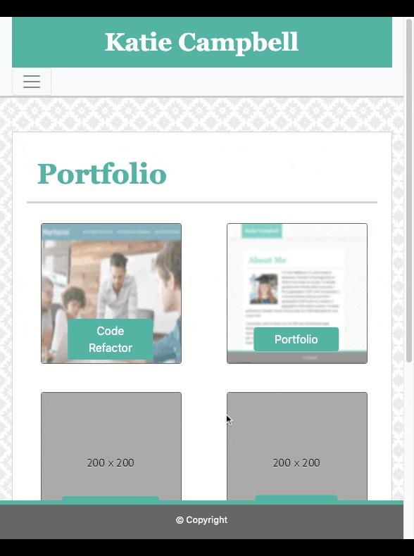

# Responsive Portfolio

## Overview

This is a responsive portfolio site built utilizing bootstrap

   

## Features

- Easily switch between pages using the navigation bar on the top of the screen
- Use the contact form to send me a message
- Click on an image under the porfolio tab to go the the repositiory for that project

## License

MIT License

## Tests

No tests available

## Questions?

You can reach me at katiecampbell21@outlook.com

---

